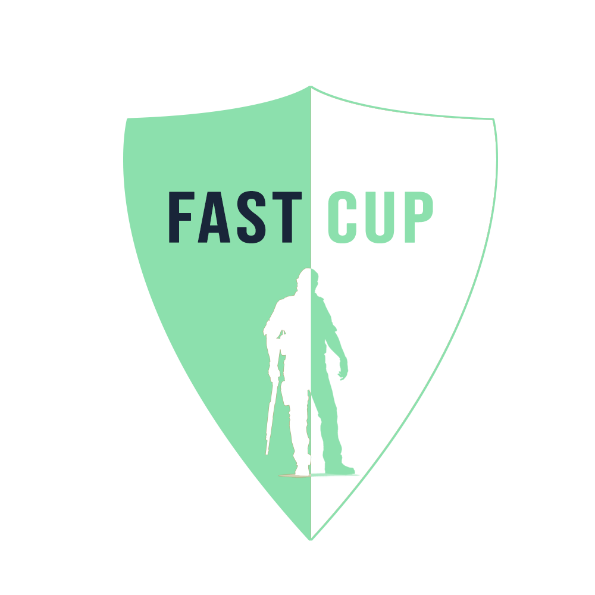
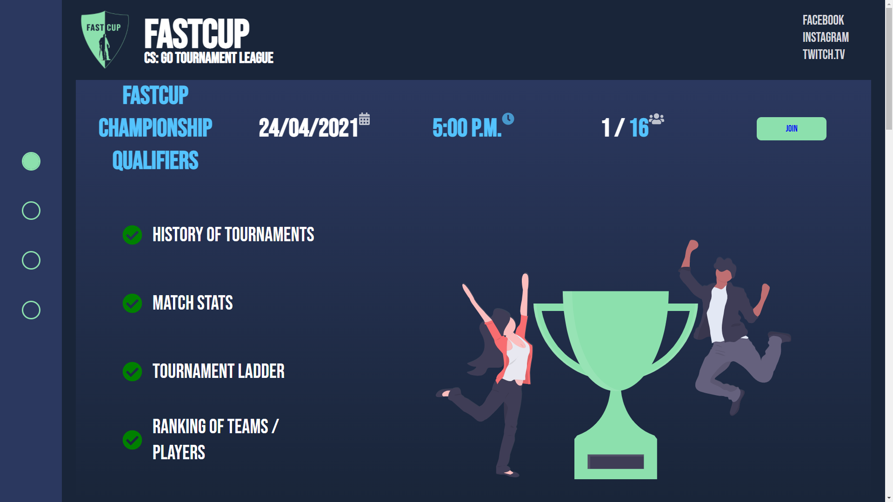
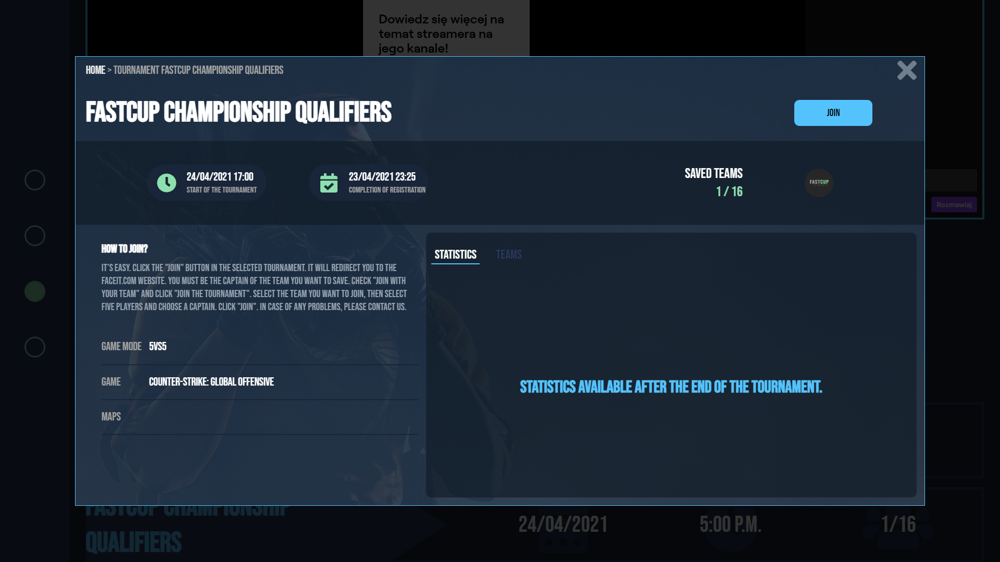

## CHECK IT ONLINE!

https://fast-cup.herokuapp.com

  
  <h3 align="center">Fast Cup - Tournaments website</h3>

  

   React application about Counter-Strike tournaments. 
     
  

## About The Project

 

User can view the tournaments and filter them. After click the
tournament, user will see modal with tournament information like date, game mode, signed teams and their
players. In second section user can watch live stream from twitch. 

### Built With

-  React
-  React-Query
-  Styled Components
-  Context API
-  Node.js
-  Express.js
